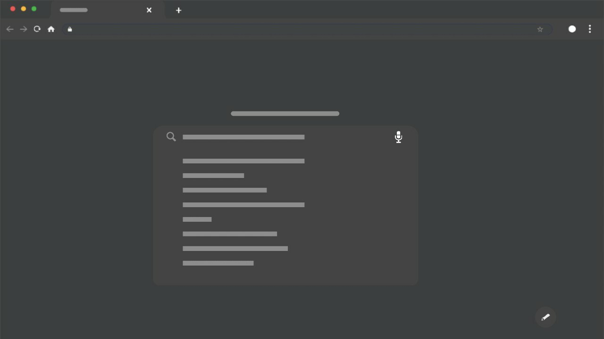

---

<!-- PROJECT LOGO -->
 
 

  

  The official repository for the KAG Portfolio.\
  [**Explore the portfolio »**](https://gam-dev.github.io/GAM-Portfolio/)\
  [Report Bug](https://github.com/KAG-Dev/KAG-Portfolio/issues) · [Request Feature](https://github.com/KAG-Dev/KAG-Portfolio/issues)

 

---
 

<!-- ABOUT THE PROJECT -->
# About The Project

Lorem ipsum dolor sit amet, consectetur adipiscing elit. Curabitur dictum dui a ante gravida tincidunt. Aenean mattis aliquet nulla, vitae iaculis tortor tristique quis. Phasellus posuere et orci vitae rutrum. Nullam bibendum pellentesque varius. Pellentesque ut nibh nulla. Sed ac ullamcorper diam, eget bibendum lorem. Integer a purus et turpis convallis interdum a dignissim lacus. Nulla mattis lectus eget ex facilisis, in volutpat lectus semper. Aenean porttitor, ex sed elementum volutpat, odio turpis fringilla tellus, at dapibus ligula nisi in arcu. Mauris elementum ornare eros. Duis at mi et elit tempor commodo.

Donec auctor accumsan consectetur. Nam sodales euismod lacus eget maximus. Mauris nec pulvinar quam, et feugiat quam. Sed sodales lacinia accumsan. Morbi condimentum magna sed rutrum congue. Morbi sit amet orci magna. Aliquam sed turpis et diam sagittis rhoncus vitae in diam. Proin pulvinar nibh neque, eu pulvinar odio ullamcorper luctus. Praesent faucibus libero eros, ac tincidunt arcu congue vel.

 

# Built With

 

 

<!-- ROADMAP -->
# Roadmap

- [x] Added `README.md`
- [ ] Create Basic HTML form
- [ ] Add `css` styling to website
- [ ] Create Multiverse

See the [open issues](https://github.com/KAG-Dev/KAG-Portfolio/issues) for a full list of proposed features (and known issues).

 

<!-- LICENSE -->
# License

Distributed under the MIT License. See `LICENSE` for more information.

 

<!-- ACKNOWLEDGMENTS -->
# Acknowledgements

*

 

<!-- CONTRIBUTORS -->
# Contributors

Thanks to all the people who have contributed to this project!

